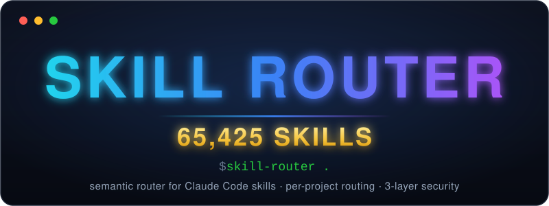
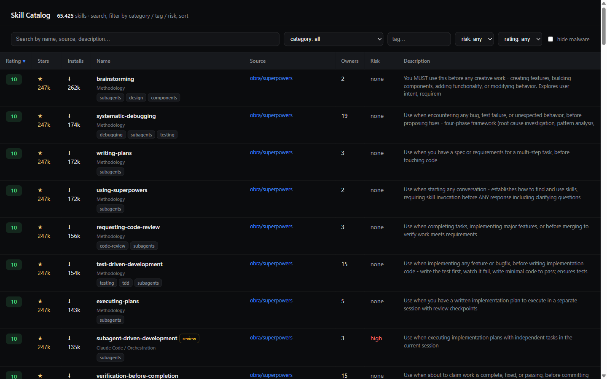
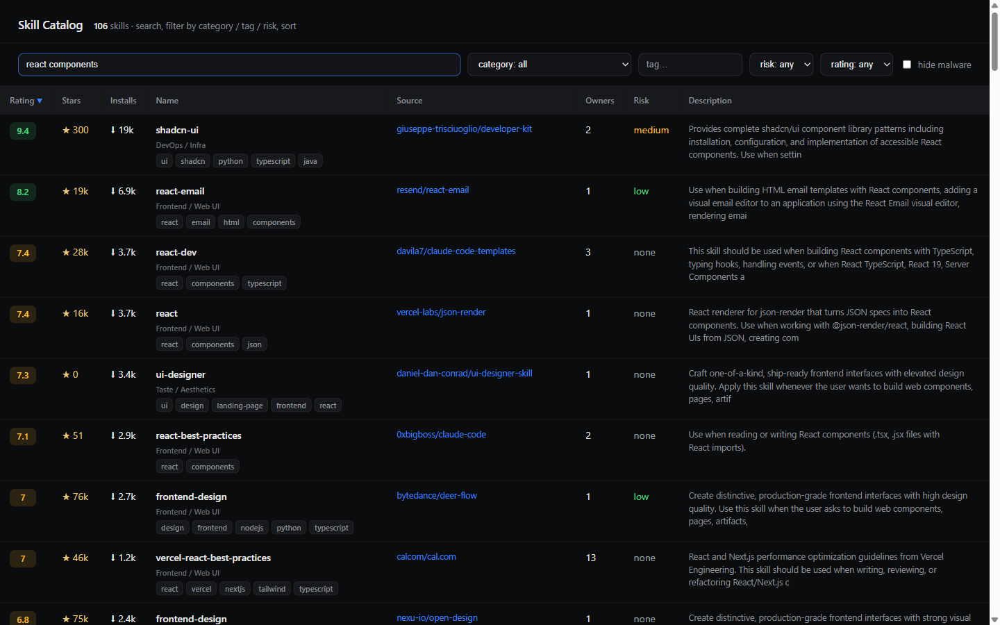

<div align="center">



# claude-skill-router

**The right skills for your project — found, ranked, and installed.**


</div>

Semantic routing for Claude Code Agent Skills over a catalog of **65,000+ real `SKILL.md` files**, mined and deduplicated from **~2,300 GitHub repos**. Point it at a repo; it figures out what the project actually needs, ranks candidates by an anti-bulk trust rating, screens them for malware, and installs a diverse set that covers every facet — not 25 near-identical React skills.

---

## What is this

**Agent Skills** are `SKILL.md` instruction files that teach [Claude Code](https://docs.claude.com/en/docs/claude-code) how to do specific tasks — Claude loads a skill automatically when it becomes relevant to what you're working on (see the [Skills docs](https://docs.claude.com/en/docs/claude-code/skills)). Thousands of them are published on GitHub; the problem is finding the ones *your* project needs and trusting what you install.

`claude-skill-router` is a **semantic router** for those skills. Instead of making you browse a registry and hand-pick, it reads your project, decomposes it into weighted *facets* (frontend, forms, animations, security, testing, database, scraping, …), and retrieves the best-matching skills by **meaning**, not keywords.

The catalog is a large, deduplicated index of skills harvested from the open-source ecosystem — with a **trust rating** that resists the usual gaming, and a **security model** that never redistributes untrusted code. You get per-project relevance, ranked by trust, checked for malware.

> **Core insight:** a *repo's* popularity is not trust in each of its *skills.* A repo that dumps 10,000 skills should not have all 10,000 inherit its star count. The router's rating is built around exactly this.

---

## Quick start

```bash
pipx install git+https://github.com/tsvelovskiysv/claude-skill-router
```

*(PyPI release coming soon — until then, install from GitHub as above.)*

Then, from inside any project, see what it *would* pick — a dry run, nothing installed:

```bash
cd my-project
skill-router select .
```

```text
Detected stack:  python   frameworks: —
Facets (stack fallback, 2):
   1.0  python
   0.5  testing quality
project stack (foreign excluded): js, python

Skills to install (45) across 2 facets:
  · python (43)
    1. python-executor      halt-catch-fire/skills   rel 0.691
    2. claude-api           anthropics/skills        rel 0.659
    3. fastapi-python       mindrally/skills         rel 0.680
    ...
  · testing quality (2)
   44. requesting-code-review  obra/superpowers      rel 0.328
   45. ab-testing           coreyhaines31/marketingskills

(dry-run — nothing installed. Run `skill-router .` to install.)
```

Happy with the set? Run the full pipeline:

```bash
skill-router .
```

That single command does detect the stack → build facets → semantic recall → diverse selection → install. **Nothing to set up manually** — on first run it auto-downloads the catalog + semantic index from GitHub Releases and the embedding model, then caches everything.

> **Tip:** set `GITHUB_TOKEN` before your first install — anonymous GitHub API access is limited to 60 requests/hour, and one full install (~45 skills) nearly exhausts it (see [Requirements](#requirements)).

---

## How it works

The router is a five-stage funnel that narrows 65k candidates down to ~45 skills that actually fit your repo:

1. **Stack detection.** Reads the project's signal files — `package.json`, `requirements.txt`, `build.gradle`, `go.mod`, `Cargo.toml`, `Gemfile`, and friends — to infer languages, frameworks, and tooling.

2. **Faceting.** Decomposes the project into **8–15 weighted facets** — the real aspects of the work (e.g. *frontend*, *design*, *forms*, *animations*, *security*, *testing*, *database*, *scraping*). Out of the box this is **stack-based** (derived from the detected stack). For richer facets, put a `.claude/skills-facets.json` file in the project — e.g. ask Claude Code to write one — and the router will use it instead:

   ```json
   [
     {"facet": "react frontend web components", "weight": 1.0},
     {"facet": "web security xss csrf auth", "weight": 0.6},
     {"facet": "end to end testing", "weight": 0.5}
   ]
   ```

   `facet` is a short English phrase describing one aspect of the project; `weight` is its importance, **0.0–1.0**.

3. **Broad recall.** For each facet, retrieves every skill with **trust rating ≥ 5** that sits semantically near it, using embeddings (`BAAI/bge-small-en`). This casts a wide, meaning-aware net per facet.

4. **Diverse selection.** Runs **MMR (Maximal Marginal Relevance)** with **per-facet quotas** and **near-duplicate removal**, yielding **~45 diverse skills that cover every facet** — instead of 25 near-identical React skills crowding out everything else.

5. **Safe install.** Fetches each chosen skill's `SKILL.md` body **on-demand from its source GitHub repo**, verified with **SHA-256**, then **re-scanned locally** for malware patterns before it is written to disk. Bodies are **never redistributed** by this project (see [Security model](#security-model)).

---

## Examples

Real output, different stacks — note how the facets, the picked skills, and the foreign-stack exclusions change with the project.

**A Next.js app** (`package.json` with `next`, `react`, `tailwindcss`, `prisma`, `stripe`):

```text
Detected stack:  nextjs   frameworks: prisma, tailwind
Facets (stack fallback, 6):
   1.0  prisma
   1.0  tailwind
   1.0  frontend next.js react
   0.7  ui ux design visual
   0.5  animations motion transitions
   0.5  testing quality
project stack (foreign excluded): js, stripe

Skills to install (45) across 6 facets:
  · tailwind (11)
    1. tailwind-design-system        wshobson/agents            rel 0.757
    2. tailwind-css-patterns         giuseppe-trisciuoglio/…    rel 0.770
    3. tailwind-v4-shadcn            secondsky/claude-skills    rel 0.720
    ...
  · frontend next.js react (15)
    1. vercel-react-best-practices   vercel-labs/agent-skills   rel 0.692
    2. nextjs-app-router-patterns    wshobson/agents            rel 0.699
    ...
  · ui ux design visual …   · animations motion transitions …   · testing quality …
```

`stripe` stays in the allowed set because it's actually in `package.json` — a Stripe skill would be kept, while a Shopify or Salesforce skill would be excluded as a product this project doesn't use. Skills named after foreign languages (`golang-*`, `azure-*`) are dropped entirely.

**A Python backend** (`requirements.txt` with `fastapi`):

```text
Detected stack:  python
Facets (stack fallback, 2):
   1.0  python
   0.5  testing quality
project stack (foreign excluded): js, python

Skills to install (45) across 2 facets:
  · python (43)
    1. python-executor      halt-catch-fire/skills   rel 0.691
    2. claude-api           anthropics/skills        rel 0.659
    3. fastapi-python       mindrally/skills         rel 0.680
    4. async-python-patterns  wshobson/agents        rel 0.660
    ...
```

The stack-fallback facets above come from project files alone. For sharper facets, add a `.claude/skills-facets.json` (see [How it works](#how-it-works)) — e.g. ask Claude Code to describe the project in 8–15 weighted facets — and the same command routes against those instead.

---

## Comparison

There are three sensible tools in this space. Here's an honest look at all three:

| | **claude-skill-router** | **autoskills** (midudev) | **skills.sh** (Vercel) |
|---|---|---|---|
| **Install** | `pipx install git+…` (GitHub) | `npx autoskills` | `npx skills add owner/repo` |
| **Runtime** | Python CLI | Ruby CLI | Hosted web + `npx` |
| **Catalog** | 65k skills / ~2.3k repos, deduped | ~40 curated stacks | ~900k indexed (~9.6k with install telemetry) |
| **Matching** | Semantic embeddings + per-project facets | Keyword / stack detection | Manual browse + leaderboard |
| **Trust ranking** | Anti-bulk rating (0–10) | None | Install-count leaderboard |
| **Per-project routing** | Yes — facets + MMR diverse selection | Partial — stack match | No — you pick manually |
| **Security** | 3-layer screening + hard-block | SHA verify on download | Snyk / Socket audits |
| **Body handling** | On-demand fetch from origin, SHA-256 verify | Downloads needed files, SHA verify | Adds from source repo |
| **Footprint** | Heavier (~100 MB index, Python) | Lightweight, no index | Hosted service |

### When to use which

- **Use `autoskills` when** you want the simplest possible one-command install for a common stack, with no local data and no Python. If your need is "install the usual React/Next skills, now," it's the fastest path.

- **Use `skills.sh` when** you want to **browse sheer volume** with live install telemetry and a leaderboard, backed by Vercel. It's by far the largest index. Caveats: install-count ranking is **gameable**, there's **no per-project routing** (you select skills yourself), and independent audits of the agent-skill ecosystem have found a meaningful malicious share — [one audit of 2,857 skills flagged ~12% as malicious](https://grith.ai/blog/agent-skills-supply-chain), and [Snyk's ToxicSkills study](https://snyk.io/blog/toxicskills-malicious-ai-agent-skills-clawhub/) confirmed 76 malicious payloads across ClawHub and skills.sh. Treat the leaderboard as popularity, not safety.

- **Use `claude-skill-router` when** you want **semantic, per-project matching with a trust ranking and a real safety model** — a non-trivial repo where you'd rather get ~45 diverse skills that genuinely cover its facets than scroll a registry. **Trade-offs:** it's heavier (a ~100 MB index and a Python install, not a single `npx`), freshness depends on periodic **catalog rebuilds**, and it's **less plug-and-play** than `autoskills`.

No tool dominates. Pick by whether you value *simplicity* (autoskills), *volume* (skills.sh), or *semantic per-project matching + trust + safety* (this).

---

## Features

- **Anti-bulk trust rating (0–10).** Computed from **unique copies across distinct owners**, **repo stars**, and **real install counts** (skills.sh telemetry) — with anti-bulk logic so a 10k-skill dump repo can't inflate all of its skills at once. Popularity of a *repo* ≠ trust in each *skill*.
- **Structured taxonomy.** Skills organized into **7 groups × 22 categories** with canonical tags for predictable filtering and browsing (`skill-router ui`).
- **Cross-platform.** Windows, macOS, and Linux are all first-class (path handling, console encoding, per-OS cache locations).
- **No telemetry.** The tool phones nobody; see [Network & privacy](#security-model).

---

## Security model

Skill marketplaces are a real supply-chain surface: skills are executable instructions, and public catalogs *do* contain malware. This project treats safety as a first-class concern, in three layers plus a distribution guarantee.

**Layer 1 — Static screening.** Every skill body is scanned with regex flags for known malware patterns: obfuscated `base64` → `exec` chains, password-protected archives, IP/payload droppers, and similar tells.

**Layer 2 — Isolated LLM audit (at catalog build time).** Any skill that trips a static flag is reviewed by an **isolated LLM audit** during catalog construction — its body is examined in a sandboxed prompt for malicious behavior. Skills still awaiting that audit are marked `needs_review`/`needs_audit` in the catalog, and this client **excludes them from selection and never installs them**.

**Layer 3 — Hard-block.** Confirmed-malicious skills are **hard-blocked** and can never be selected, fetched, or installed. **41 known-malicious skills are currently blocked.** During catalog construction we found and quarantined real, live malware — including **ClawHavoc**, which shipped C2 (command-and-control) server addresses inside skill bodies.

**Client-side re-scan.** The catalog isn't trusted blindly. When you install a skill, the fetched body is run through the layer-1 static screen **again, locally on your machine**, before anything is written to disk — a body carrying a hard malware pattern (obfuscated exec, password archive, IP dropper) is refused even if the catalog marked it clean. This is independent of the build pipeline: it defends against a catalog that's wrong, out of date, or compromised.

**Distribution guarantee — no redistribution.** The catalog this project ships contains **metadata and embeddings only** — names, tags, ratings, categories, vectors. It **never contains skill bodies.** When you install a skill, its `SKILL.md` body is fetched **on-demand from the original GitHub repo** and verified against a stored **SHA-256** hash.

> **What this means:** catalog metadata is safe to distribute and update freely. Bodies always come **from origin**, verified. Because untrusted code is never redistributed and known malware is hard-blocked, **this project is designed not to become a malware propagation vector**: a skill body that changed after cataloguing fails the SHA check and is skipped, and a record with no SHA is skipped too (fail-closed).

**What `install` actually touches.** For each installed skill the tool creates `<project>/.claude/skills/<name>/SKILL.md`, and adds an entry for it to `skillOverrides` in `<project>/.claude/settings.json` (mode `name-only`). Nothing else in `settings.json` is modified; if the file is invalid JSON, the original is preserved as a timestamped `.bak` before being rebuilt.

**Network & privacy.** The tool makes exactly three kinds of network requests: GitHub Releases (catalog updates), the GitHub Contents API (skill bodies at install time), and a one-time HuggingFace download of the embedding model. Your project is embedded **locally**; no code, telemetry, or usage data ever leaves your machine.

The full screening methodology — every pattern class, the audit flow, and the honest limits of what SHA pinning does and doesn't prove — is documented in [docs/screening.md](docs/screening.md).

### FAQ: why only 41 hard-blocked skills, when audits report ~12% malicious?

Different populations. The ~12% figure comes from an audit of **ClawHub** (2,857 skills; 335 of the 341 malicious ones were a single campaign, ClawHavoc — which this catalog *did* find and quarantine). This catalog is mined from general GitHub repos, where malware concentration is far lower; identical malicious bodies dedupe into single entities; ~1,800 `needs_review` entities are additionally excluded from install until audited; and routing draws only from the rating ≥ 5 pool, which junk doesn't reach. Details and the trust-model fine print: [docs/screening.md](docs/screening.md).

---

## Commands

```bash
# Full pipeline on the current directory: detect → facet → recall → select → install
skill-router .                        # --top N picks a smaller set (default 45)

# Routing only — print the chosen skills for this project, install nothing (dry run)
skill-router select .                 # --about "text" adds a project description;
                                      # --top 12 for a lean set

# Install specific skills by name (on-demand fetch from origin + SHA-256 verify)
skill-router install <skill-name> ...  # -p/--project <dir> targets another project (default: .)

# Pull the latest catalog + semantic index from GitHub Releases
skill-router update                   # --force re-downloads even if the version matches

# Open the catalog in your browser — search, filter by category / tag / risk, sort
skill-router ui                       # --no-open starts the server without opening a browser
```

### Browse the catalog (`skill-router ui`)

```bash
skill-router ui              # starts a local server and opens your browser
skill-router ui --no-open    # server only — open http://127.0.0.1:8765 yourself
```

A local dashboard (**localhost only** — the server binds to `127.0.0.1` and validates the `Host` header) over the full 65k catalog. Each row shows the trust rating, repo stars, skills.sh install count, category, tags, source repo, and risk level:



Search matches names, source repos, and descriptions; combine it with the category dropdown, tag filter, risk filter, minimum rating, and the "hide malware" toggle. Click any column to sort, click a tag to filter by it:



Great for exploring what's out there before routing a project, or for cherry-picking single skills to install by name.

### How many skills should you install?

The default `--top 45` is built for **coverage**: every facet of a non-trivial project gets skills. If you prefer a tighter context and sharper skill activation — many practitioners do — go lean:

- `skill-router . --top 12` for a small, focused set (the coverage quota of 2 skills per facet sets the floor, so with many facets you may get slightly more), or
- use the router as **discovery only**: `skill-router select .` / `skill-router ui` to find candidates, then `skill-router install <name> <name> …` for the 3–5 you actually read and trust.

Installed skills run in `name-only` mode (Claude Code keeps just the name + one-line description in context and loads a body on demand), so even the full set stays cheap in tokens — but a smaller, hand-reviewed set is the right call for sensitive codebases. See the trust notes in [docs/screening.md](docs/screening.md).

---

## Auto-update

The catalog and semantic index are distributed through a **GitHub Releases** channel, so updates are a single command:

```bash
skill-router update
```

The maintainer workflow is symmetric and simple:

1. Maintainers **add / re-rate / re-screen skills** in the catalog.
2. A new **GitHub Release** is published with the refreshed catalog + index.
3. Users run `skill-router update` to fetch it.

Because releases carry **metadata and embeddings only** (never skill bodies), updates are lightweight and safe to pull — the actual skill code is still fetched from origin at install time with SHA verification.

---

## Requirements

- **Python 3.10+** (install via `pipx` recommended). **Windows, macOS, and Linux** are supported.
- **~100 MB catalog + semantic index**, downloaded on first run and cached locally.
- The embedding model (`BAAI/bge-small-en`, ~65 MB) is downloaded once on first use from HuggingFace.
- Network access to GitHub (for `update` and for on-demand body fetches).
- **`GITHUB_TOKEN` recommended.** Body fetches use the GitHub API, which allows only **60 anonymous requests/hour** — one full install (~45 skills) nearly exhausts it. The CLI **checks your remaining quota before installing** and warns you (or stops, if the quota is already exhausted) with the reset time. Set `GITHUB_TOKEN` (any classic token, no scopes needed) to raise the limit to 5,000/hour:

  ```bash
  export GITHUB_TOKEN=ghp_...        # or GH_TOKEN
  ```

### Where data lives

| OS | Cache location |
|---|---|
| Windows | `%LOCALAPPDATA%\claude-skill-router` |
| macOS | `~/Library/Application Support/claude-skill-router` |
| Linux | `$XDG_DATA_HOME/claude-skill-router` (default `~/.local/share/…`) |

Two environment variables override defaults: `CLAUDE_SKILL_ROUTER_DATA` (cache directory) and `CLAUDE_SKILL_ROUTER_REPO` (GitHub repo the catalog releases are pulled from).

**Uninstall:** `pipx uninstall claude-skill-router`, delete the cache directory above, and remove `.claude/skills/` from projects where you installed skills.

---

## Roadmap

- Broader stack detection (more languages, monorepos, polyglot repos).
- **Delta catalog updates** — incremental releases instead of full index pulls.
- Optional **offline / local re-ranking** mode with no LLM dependency.
- **Shared team profiles** — commit a project's facet/skill set for reproducible onboarding.
- Editor integration (VS Code) for one-click routing.
- Expanded community trust signals feeding the rating.

---

## Contributing & changelog

Issues and PRs are welcome. The catalog build pipeline (mining, clustering, rating, security screening) lives in a separate private repository; this repo contains the client and receives the published catalog through Releases. Changes ship as [GitHub Releases](https://github.com/tsvelovskiysv/claude-skill-router/releases) — release notes double as the changelog.

---

## License

[MIT](LICENSE) © the `claude-skill-router` contributors.
